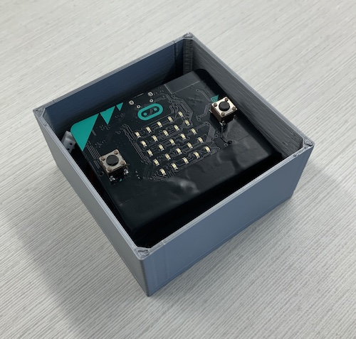

# ASE (Awesome Sensor Example)

## Summary of the Solution
The solution was to make a simple box that holds a MicroBit and the battery pack. The sensor streams accelerometer data to a second MicroBit that logs the data.

## Overview of the Process
To create the project we did lots of important things...

**Need to add drawing and photos of prototypes**

## Reflection

The team did well with getting it done, but we probably could have redesigned the enclosure.
